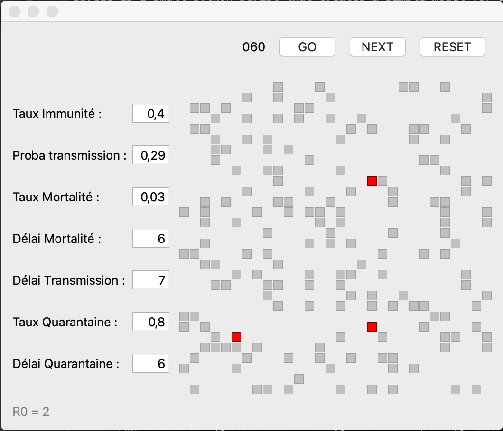

# spread
Spread is a small python script that creates a simple model for disease spreading. It takes into account :
- The population existing immunity
- The infection probability of the disease
- The infection time once a person has been infected
- The dead rate
- The quarantaine efficiency : the percentage of the infected people that goes into quarantaine after they have been infected
- The time it takes to put an infected person into quarantaine 

The result is displayed through a simple grid, that shows if an individual is :
- Not ill (white color)
- Immune (grey color)
- Ill (red color)
- In quarantine (yellow color)
- Dead (black color)

At the beginning, a given population is composed of immune people, not immune people, and ill people (the first clusters). 
Right now there a 3 clusters in the application, and that must be changed directly into the python code.

