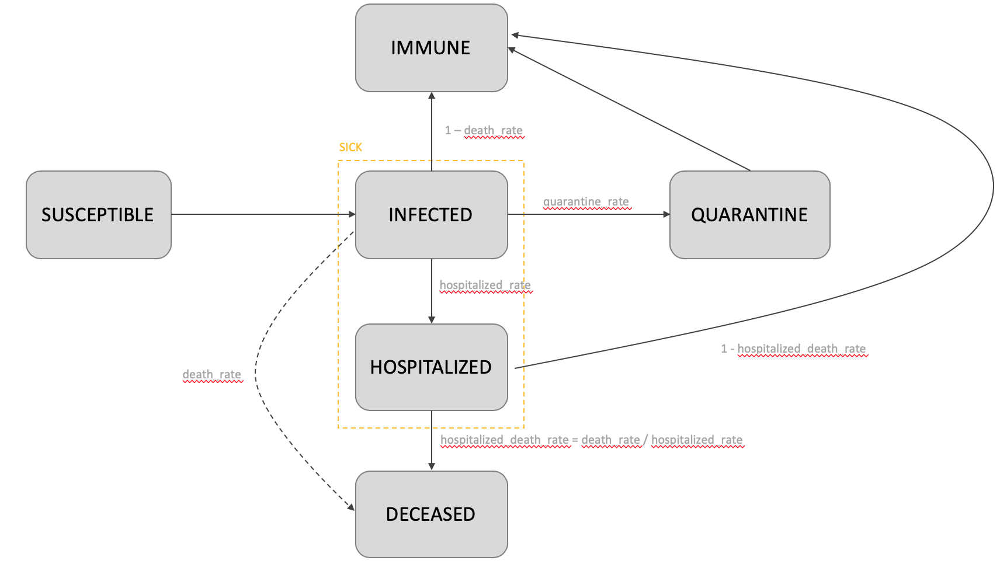
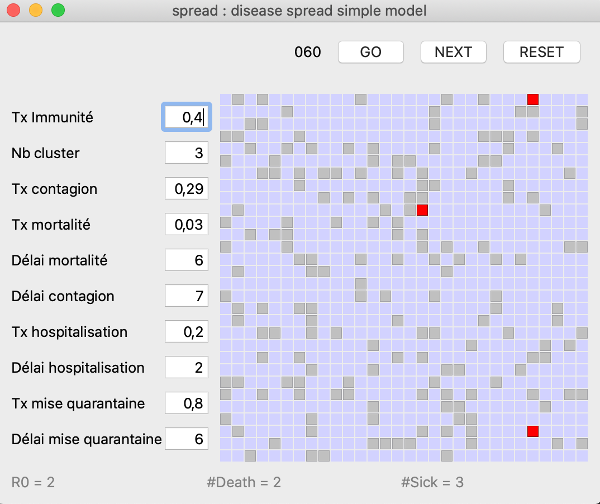
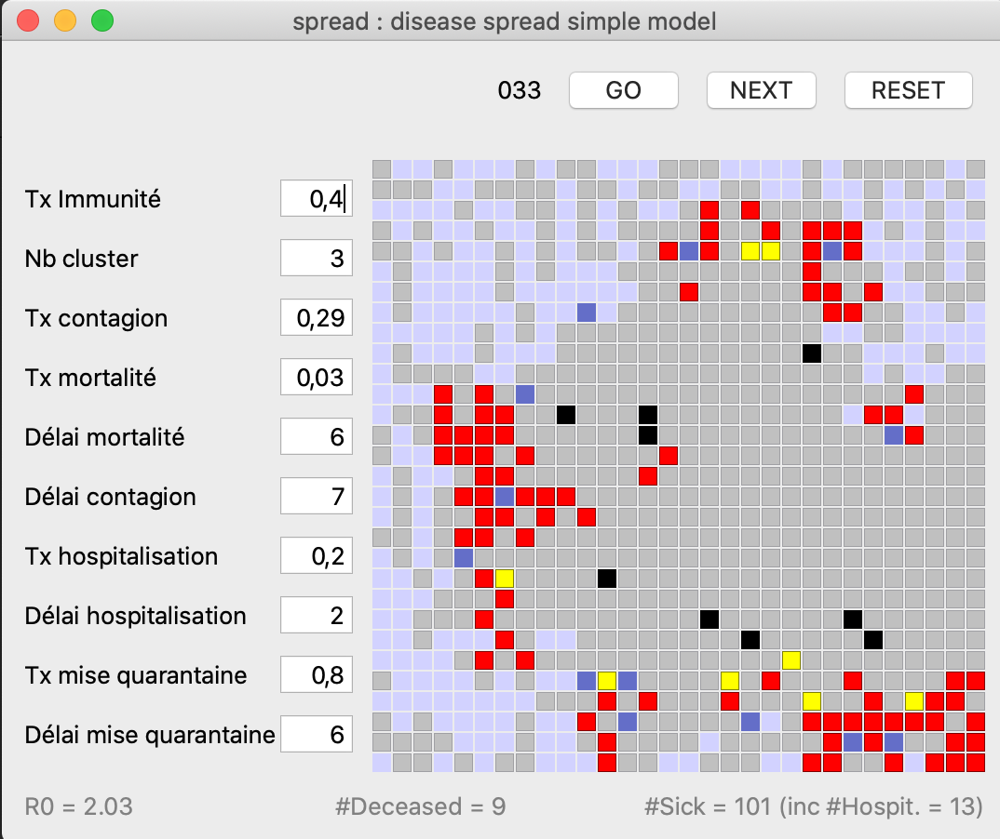

# spread

## Introduction
Spread is a small python script that creates a simple model for disease spreading among a population. The idea is to be able to watch the effects of the variation for several key parameters. It takes into account :

- The existing immunity among the population
- The infection probability of the disease
- The contagion time once a person has been infected
- The dead rate
- The quarantaine efficiency : the percentage of the infected people that goes into quarantaine after they have been infected
- The time it takes to put an infected person into quarantaine 

Of course, it is assumed that once a sick person is into quarataine, they cannot infect any other person.

## Model

The model used is a variation of a SIQRD model. This model distributes the population among 5 categories :

- **S for Susceptible**: people not infected, who might become sick
- **I for Infected**: people infected
- **Q for Quarantine**: people infected but isolated so that they cannot infect any more people
- **R for Recovered**: people who were infected but recovered, and who are now immune to the disease
- **D for Deceased**: people who died from the disease

The following changes are done to the model :

- the recovered compartment R includes the people immune for genetical reasons.
- a new **H for Hospitalized** state has been added, in order to assess the disease impact of healthcare system

The model used is showed on the following illustration 



It is also assumed (ie simplified) that 

- contagion state and infected state are the same state : as soon as a patient has recovered, he is not contagious anymore, and vice-versa
- every patient died in hospital, that is no critical case is ignored to point to ignore hospitalization
- patient in quarantine can end up at the hospital if the delay between infection and severe symptom is higher than the diagnosis delay


## Usage

```{console}    
Usage: spread [options] round_number board_size cluster_number
            round_number: number of rounds for the simulation
            board_size: size of the board
            cluster_number: number of initial board disease clusters
```

## Output examples

The result is displayed through a simple grid, that shows if an individual is :
- Not sick (light blue color)
- Immune (grey color)
- Sick (red color)
- In quarantine (yellow color)
- Hospitalized (dark blue color)
- Dead (black color)

At the beginning, a given population is composed of immune people, not immune people, and sick people (the first clusters). 
Right now there a 3 clusters in the application, and that must be changed directly into the python code.



Once the GO button has been pushed, the simulation goes on, round by round, and one can see how the disease spread.



## Parameter change

At the end of each simulation, the user that change the parameters as he likes, and test the effect on the spreading of the disease, by pressing the "RESET button", to generate a new "Disease Board", then "GO", to launch the simulation.

## TODO

*See Issues in GitHub page*

## Significant bugs with associated libraries

Right now there is a bug on Mac OS Mojave that seems to prevent Qt5 from having a nice display behavior. That may result in pressing the "RESET" button having no visual effect. However, the modelisation effectively starts when pressing the "GO" button. This does not happen on Windows.

On **Windows and Python 3.8**, there is a bug with the pyqtgraph 0.10.0 library, that causes the error 

```{console}    
File "C:\Program Files\Python38\lib\site-packages\pyqtgraph\ptime.py", line 24, in <module>
    cstart = systime.clock()  ### Required to start the clock in windows
```

Instead of installing the normal pygtgraph, please use 

```{console}    
pip install git+https://github.com/pyqtgraph/pyqtgraph@develop
```
 
